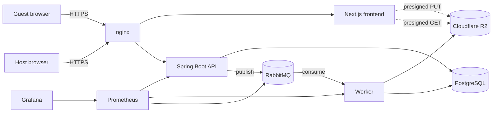

# EventShare

Collaborative event media sharing. A host creates an event, shares a QR code or link,
and guests upload photos and videos straight into a shared gallery. Hosts can moderate
content, view analytics, and export everything.

This repository contains a production-structured monorepo built as a modular monolith
plus a background worker. It is designed to run on a single VPS while following
distributed-system principles (stateless API, async processing, object storage,
horizontal-ready services).

> Status: this is an end-to-end vertical slice of the full specification. The path
> "create event to guest upload to R2 to shared gallery" is implemented across the whole
> stack, with the schema, async pipeline, observability, and deployment topology in place
> for the remaining features to build on. See `docs/DECISIONS.md` and the Roadmap below.

## What works today

Host creates an event (Clerk-authenticated) and receives an invite code, link, and QR.
Guests open the link, add their name (no account required), and upload media. Each upload
goes directly to Cloudflare R2 through a presigned URL, is recorded with exact SHA-256
duplicate detection, and emits a RabbitMQ event. The worker consumes that event, generates
a thumbnail (image or video poster frame), extracts dimensions and duration, and writes the
results back. The gallery renders newest-first with keyset pagination, infinite scroll, and
near-real-time refresh. Prometheus scrapes the services and Grafana visualizes them.

## Architecture at a glance



Media bytes never transit the API or worker request path on the way in: the browser uploads
directly to R2. The worker pulls originals from R2 only to derive thumbnails. See
`docs/ARCHITECTURE.md` for request-level sequence diagrams.

## Technology

Frontend: Next.js 15 (App Router), TypeScript, TailwindCSS, React Query, Zustand, Clerk,
PWA manifest. Backend: Spring Boot 3.5 on Java 25, Spring Security (OAuth2 resource server),
Spring Data JPA, Flyway, Spring AMQP, AWS SDK v2 (R2). Worker: Spring Boot, Thumbnailator,
ffmpeg. Data: PostgreSQL 16. Storage: Cloudflare R2. Messaging: RabbitMQ. Observability:
Micrometer, Prometheus, Grafana. Delivery: Docker, Docker Compose, nginx, GitHub Actions.

## Repository layout

```
backend/    Spring Boot API (events, media, moderation schema, signed URLs, messaging)
worker/     Spring Boot worker (RabbitMQ consumer, thumbnailing, metadata)
frontend/   Next.js application (host dashboard, guest gallery, uploads)
infra/      nginx, prometheus, grafana, rabbitmq configuration
docs/       Architecture, ERD, ADRs, API, environment, deployment, operations, onboarding
.github/    CI and deployment workflows
docker-compose.yml   Full single-VPS topology
docker-compose.prod.yml   Production override for host-Nginx setups
deploy/              Host Nginx site template(s) for VPS installation
.env.example         Environment template
```

## Quick start (Docker Compose)

Prerequisites: Docker and Docker Compose. A Cloudflare R2 bucket and a Clerk application
(both free to start) for real uploads and auth.

```bash
cp .env.example .env
# Fill in R2_*, CLERK_*, and the NEXT_PUBLIC_CLERK_* values in .env
docker compose up -d --build
```

Then open `http://localhost` (nginx). The API is proxied at `/api`, Grafana at `/grafana`.
Full setup, TLS, and first-run notes are in `docs/DEPLOYMENT.md`. Every variable is
documented in `docs/ENVIRONMENT.md`.

## Production deployment model

In production this repo keeps the Docker Compose stack, but it sits behind your existing
host Nginx and Let's Encrypt setup:

- Docker Compose runs the application services
- the app's container Nginx listens only on `127.0.0.1:8088`
- host Nginx terminates TLS and forwards traffic to that local port
- GitHub Actions deploys on push to `main` by SSHing to the VPS and running
  `scripts/deploy-prod.sh`

See `deploy/nginx/eventshare.conf` for the host site template.

## Local development (without Docker)

Run PostgreSQL and RabbitMQ locally (or `docker compose up -d postgres rabbitmq`), then:

```bash
# API
cd backend && mvn spring-boot:run
# Worker (new shell)
cd worker && mvn spring-boot:run
# Frontend (new shell)
cd frontend && cp .env.local.example .env.local && npm install && npm run dev
```

Defaults in `application.yml` point at localhost services. See `docs/ONBOARDING.md`.

## Testing

```bash
cd backend && mvn verify   # unit tests + Testcontainers integration tests (needs Docker)
cd worker  && mvn test
cd frontend && npm run typecheck
```

## CI/CD

`.github/workflows/ci.yml` builds and tests all three services on every push and pull
request. `.github/workflows/deploy.yml` deploys to the VPS over SSH (manual trigger;
configure the `VPS_*` repository secrets). See `docs/DEPLOYMENT.md`.

## Documentation

```
docs/ARCHITECTURE.md   Components, data flows, scalability, tradeoffs
docs/ERD.md            Database entity-relationship diagram and table reference
docs/DECISIONS.md      Architecture decision records (ADRs)
docs/API.md            REST endpoint reference and examples
docs/ENVIRONMENT.md    Every environment variable
docs/DEPLOYMENT.md     VPS deployment, TLS, CI/CD secrets
docs/OPERATIONS.md     Monitoring, backups, disaster recovery, scaling, runbooks
docs/ONBOARDING.md     Developer setup and conventions
```

## Roadmap (remaining specification phases)

The schema and pipeline already account for these; they are the next vertical slices:
host moderation actions (hide, restore, archive, delete) with audit trail; asynchronous
ZIP export jobs (download flow plus worker consumer for the export queue and notifications);
WebSocket gallery updates replacing the polling baseline; admin role and management;
multi-event host dashboard listing; and AI-based near-duplicate clustering layered on top
of the existing exact SHA-256 detection.

## License

Proprietary. All rights reserved.
