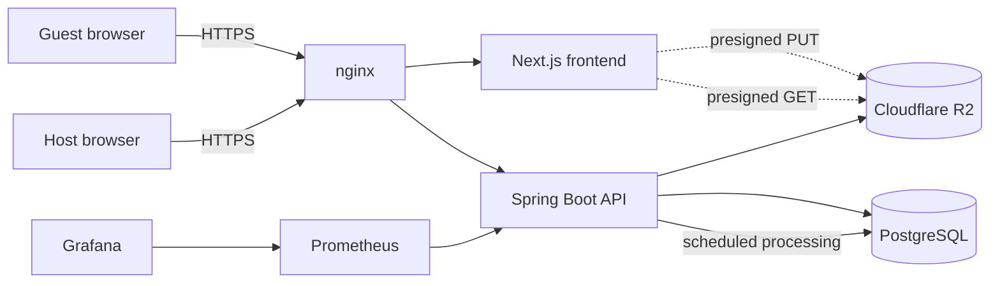

# EventShare

Collaborative event media sharing. A host creates an event, shares a QR code or link,
and guests upload photos and videos straight into a shared gallery. Hosts can moderate
content, view analytics, and export everything.

This repository contains a production-structured modular monolith designed to run on the
tunneled `vps01` home server. Media processing currently runs in-process through a durable
database-backed scheduler; the former broker/worker path is retained for later reintroduction.

> Status: this is an end-to-end vertical slice of the full specification. The path
> "create event to guest upload to R2 to shared gallery" is implemented across the whole
> stack, with the schema, async pipeline, observability, and deployment topology in place
> for the remaining features to build on. See `docs/DECISIONS.md` and the Roadmap below.

## What works today

Host creates an event (Clerk-authenticated) and receives an invite code, link, and QR.
Guests open the link, add their name (no account required), and upload media. Each upload
goes directly to Cloudflare R2 through a presigned URL, is recorded with exact SHA-256
duplicate detection. The API scheduler generates a thumbnail (image or video poster frame),
extracts dimensions and duration, and writes the results back. The gallery renders newest-first
with keyset pagination, infinite scroll, and near-real-time refresh. Prometheus scrapes the API
and Grafana visualizes it when monitoring is enabled.

## Architecture at a glance


```mermaid
flowchart LR
  Guest[Guest browser] -->|HTTPS| NG[nginx]
  Host[Host browser] -->|HTTPS| NG
  NG --> FE[Next.js frontend]
  NG --> API[Spring Boot API]
  FE -. presigned PUT .-> R2[(Cloudflare R2)]
  FE -. presigned GET .-> R2
  API --> PG[(PostgreSQL)]
  API -->|scheduled processing| PG
  API --> R2
  PROM[Prometheus] --> API
  GRAF[Grafana] --> PROM
```

Media bytes never transit the API request path on the way in: the browser uploads directly to
R2. The API scheduler pulls originals from R2 only to derive thumbnails. See `docs/ARCHITECTURE.md`
for the broader architecture and the deferred broker-backed design.

## Technology

Frontend: Next.js 15 (App Router), TypeScript, TailwindCSS, React Query, Zustand, Clerk,
PWA manifest. Backend: Spring Boot 3.5 on Java 25, Spring Security (OAuth2 resource server),
Spring Data JPA, Flyway, AWS SDK v2 (R2), Thumbnailator, and ffmpeg. Data: PostgreSQL 16.
Storage: Cloudflare R2. Observability: Micrometer, Prometheus, Grafana. Delivery: Docker,
Docker Compose, nginx, and GitHub Actions.

## Repository layout

```
backend/    Spring Boot API (events, media, moderation schema, signed URLs, in-process processing)
worker/     Deferred Spring Boot worker (retained for later RabbitMQ reintroduction)
frontend/   Next.js application (host dashboard, guest gallery, uploads)
infra/      nginx, prometheus, grafana, and deferred RabbitMQ configuration
docs/       Architecture, ERD, ADRs, API, environment, deployment, operations, onboarding
.github/    CI and deployment workflows
docker-compose.yml   vps01 single-host topology
docker-compose.prod.yml   Production override for host-Nginx setups
docker-compose.override.yml   vps01 resource limits and opt-in monitoring
deploy/              Host Nginx site template(s) for VPS installation
.env.example         Environment template
```

## Quick start (Docker Compose)

Prerequisites: Docker and Docker Compose. A Cloudflare R2 bucket and a Clerk application
(both free to start) for real uploads and auth.

```bash
cp .env.example .env
# Fill in R2_*, CLERK_*, and the NEXT_PUBLIC_CLERK_* values in .env
docker compose up -d --build
```

Windows one-command shortcut:

```powershell
.\run.cmd
```

Then open `http://localhost` (nginx). The API is proxied at `/api`; Grafana is available at
`/grafana` when the `monitoring` profile is enabled.
For this stack, nginx is published on `http://localhost:8088`.

- API root: `http://localhost:8088/api/`
- API ping: `http://localhost:8088/api/ping`
- Grafana: `http://localhost:8088/grafana/`

To enable Swagger/OpenAPI only for local development, set these before starting the stack:

```bash
SPRING_PROFILES_ACTIVE=prod,local
LOCAL_DEV_OPENAPI_ENABLED=true
```

Then open `http://localhost:8088/api/swagger-ui/index.html`.
Full setup, TLS, and first-run notes are in `docs/DEPLOYMENT.md`. Every variable is
documented in `docs/ENVIRONMENT.md`.

## Production deployment model

In production this repo keeps the Docker Compose stack, but it sits behind your existing
host Nginx and Let's Encrypt setup:

- Docker Compose runs the application services
- the app's container Nginx listens only on `127.0.0.1:8088`
- host Nginx terminates TLS and forwards traffic to that local port
- GitHub Actions deploys on push to `main` using a self-hosted runner on `vps01`, which runs
  `scripts/deploy-prod.sh`
- Windows operators can deploy manually through the `myvps` SSH alias with
  `scripts/deploy-to-myvps.ps1`

See `deploy/nginx/eventshare.conf` for the host site template.

## Local development (without Docker)

Run PostgreSQL locally with Docker, then:

```bash
# API
cd backend && mvn spring-boot:run
# Frontend (new shell)
cd frontend && cp .env.local.example .env.local && npm install && npm run dev
```

Defaults in `application.yml` point at localhost services. See `docs/ONBOARDING.md`.

## Testing

```bash
cd backend && mvn verify   # unit tests + Testcontainers integration tests (needs Docker)
cd worker  && mvn test
cd frontend && npm run typecheck
```

## Admin and demo accounts

For test and live environments, platform access and no-payment plan overrides are
available from the admin panel and environment configuration.

- `ADMIN_EMAILS`: comma-separated emails that are auto-granted `ADMIN` on sign-in.
- `ADMIN_CLERK_USER_IDS`: comma-separated Clerk user ids that are auto-granted
  `ADMIN` even if the JWT email claim is missing.
- `DEMO_EMAILS`: comma-separated recruiter/demo emails that receive unlimited plan
  limits automatically.

From the in-app admin page you can:

- assign plan tiers to any user (including `UNLIMITED`) without charging payment,
- whitelist users for unlimited access,
- enable/disable users, and
- archive/remove events.

## CI/CD

`.github/workflows/ci.yml` builds and tests the active API/frontend path on every push and pull
request. `.github/workflows/deploy.yml` deploys from a self-hosted runner installed on `vps01`
(label `eventshare-vps01`) after CI passes on `main`, and also supports manual trigger. It
deploys from `$HOME/apps/eventshare` by default (or `VPS_APP_DIR` if set in the runner
environment). See `docs/DEPLOYMENT.md`.

## Documentation

```
docs/ARCHITECTURE.md   Components, data flows, scalability, tradeoffs
docs/ERD.md            Database entity-relationship diagram and table reference
docs/DECISIONS.md      Architecture decision records (ADRs)
docs/API.md            REST endpoint reference and examples
docs/ENVIRONMENT.md    Every environment variable
docs/DEPLOYMENT.md     VPS deployment, TLS, CI/CD secrets
docs/DEPLOYMENT_RUNBOOK.md  Reproducible vps01 cutover and continuous deployment runbook
docs/OPERATIONS.md     Monitoring, backups, disaster recovery, scaling, runbooks
docs/ONBOARDING.md     Developer setup and conventions
```

## Roadmap (remaining specification phases)

The schema and pipeline already account for these; they are the next vertical slices:
host moderation actions (hide, restore, archive, delete) with audit trail; asynchronous
ZIP export jobs (download flow plus worker consumer for the export queue and notifications);
WebSocket gallery updates replacing the polling baseline; admin role and management;
multi-event host dashboard listing; and AI-based near-duplicate clustering layered on top
of the existing exact SHA-256 detection.

## License

Proprietary. All rights reserved.
