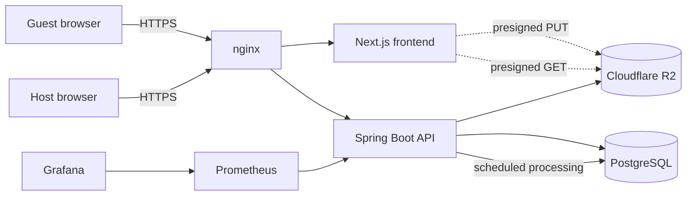

# EventShare

Collaborative event media sharing. A host creates an event, shares a QR code or link, and
guests upload photos and videos straight into one shared gallery. No app and no account are
needed for guests. Hosts moderate content, see analytics, and download everything.

**Live:** https://eventshare.munashemudabura.com

## Current status (October 2026)

EventShare is live in production on a self-hosted server (`vps01`), deployed automatically
from `main` by GitHub Actions. It is a modular monolith: one Spring Boot API, a Next.js
frontend, PostgreSQL and Cloudflare R2, with media processing running in-process on a
database-backed work queue. Every significant change is documented in `docs/changes/`.

| Area | Status |
|---|---|
| Events, invites, QR codes, guest join (with or without an account) | Live |
| Direct-to-R2 uploads, thumbnails and video posters, duplicate detection | Live |
| Gallery viewer, real file downloads, ZIP downloads on paid plans | Live |
| Host moderation, photo reporting with auto-hide, guest self-delete | Live |
| Plans, Stripe billing, promo codes, whitelist, admin panel | Live |
| Event and platform analytics | Live |
| Public interview demo with nightly reset and abuse guardrails | Live |
| Privacy Policy and Terms of Use, automatic data retention jobs | Live (legal review pending) |
| Mobile app (Expo) | Basic guest flow; not published |

## Features

- **For guests:** join with just a name, upload from the gallery or the camera, browse,
  download single files, and delete or report photos. Signed-in guests keep the event in
  "My Events".
- **For hosts:** create events, share by link or QR, moderate (hide, restore, delete), see
  reported photos, manage guests, choose a cover photo and display settings, and view upload
  and visitor analytics.
- **Downloads:** every photo saves as a real file. Paid plans add "Download all" and
  "Download selected" as a ZIP, built in the browser straight from R2.
- **Safety and privacy:** uploads are size-checked at three layers (API, signed upload URL,
  completion check); guests can only delete their own uploads; anyone can report a photo, and
  three reports or one child-safety report hide it until the host reviews it; deleted photos
  and events are erased permanently after 30 days; raw IP addresses are cleared from logs
  after 90 days.
- **Plans:** Free, Basic, Wedding Pro and Lifetime, with limits enforced race-safely in the
  database; Stripe checkout and billing portal; promo codes; admin overrides.
- **Admin panel:** users, events, promo codes, whitelist, platform analytics with monthly
  growth, live server performance, and demo controls.

## Live demo

- Guest gallery, no login: https://eventshare.munashemudabura.com/e/EVENTSHARE
- Host login: **username:** `demo-host`, **password:** `YOUR-DEMO-PASSWORD`
  <!-- Replace with DEMO_HOST_PASSWORD from the server's .env. -->

The demo resets every night at 4 AM US Central. Guests can upload up to 4 photos each
(8 in total per day, 25 MB per file). The demo account can explore everything but cannot
delete or rename the demo events or use billing.

## Architecture at a glance


```mermaid
flowchart LR
  Guest[Guest browser] -->|HTTPS| NG[nginx]
  Host[Host browser] -->|HTTPS| NG
  NG --> FE[Next.js frontend]
  NG --> API[Spring Boot API]
  FE -. presigned PUT .-> R2[(Cloudflare R2)]
  FE -. presigned GET .-> R2
  API --> PG[(PostgreSQL)]
  API -->|scheduled processing| PG
  API --> R2
  PROM[Prometheus] --> API
  GRAF[Grafana] --> PROM
```

Media bytes never transit the API request path on the way in: the browser uploads directly to
R2. The API scheduler pulls originals from R2 only to derive thumbnails. See `docs/ARCHITECTURE.md`
for the broader architecture and the deferred broker-backed design.

## Technology

Frontend: Next.js 15 (App Router), TypeScript, TailwindCSS, React Query, Zustand, Clerk,
PWA manifest. Backend: Spring Boot 3.5 on Java 25, Spring Security (OAuth2 resource server),
Spring Data JPA, Flyway, AWS SDK v2 (R2), Thumbnailator, and ffmpeg. Data: PostgreSQL 16.
Storage: Cloudflare R2. Observability: Micrometer, Prometheus, Grafana. Delivery: Docker,
Docker Compose, nginx, and GitHub Actions.

## Repository layout

```
backend/    Spring Boot API (events, media, moderation schema, signed URLs, in-process processing)
worker/     Deferred Spring Boot worker (retained for later RabbitMQ reintroduction)
frontend/   Next.js application (host dashboard, guest gallery, uploads)
infra/      nginx, prometheus, grafana, and deferred RabbitMQ configuration
docs/       Architecture, ERD, ADRs, API, environment, deployment, operations, onboarding
.github/    CI and deployment workflows
docker-compose.yml   vps01 single-host topology
docker-compose.prod.yml   Production override for host-Nginx setups
docker-compose.override.yml   vps01 resource limits and opt-in monitoring
deploy/              Host Nginx site template(s) for VPS installation
.env.example         Environment template
```

## Quick start (Docker Compose)

Prerequisites: Docker and Docker Compose. A Cloudflare R2 bucket and a Clerk application
(both free to start) for real uploads and auth.

```bash
cp .env.example .env
# Fill in R2_*, CLERK_*, and the NEXT_PUBLIC_CLERK_* values in .env
docker compose up -d --build
```

Windows one-command shortcut:

```powershell
.\run.cmd
```

Then open `http://localhost:8088` (nginx). The API is proxied at `/api`; Grafana is available
at `/grafana` when the `monitoring` profile is enabled.

- API root: `http://localhost:8088/api/`
- API ping: `http://localhost:8088/api/ping`
- Grafana: `http://localhost:8088/grafana/`

To enable Swagger/OpenAPI only for local development, set these before starting the stack:

```bash
SPRING_PROFILES_ACTIVE=prod,local
LOCAL_DEV_OPENAPI_ENABLED=true
```

Then open `http://localhost:8088/api/swagger-ui/index.html`.
Full setup, TLS, and first-run notes are in `docs/DEPLOYMENT.md`. Every variable is
documented in `docs/ENVIRONMENT.md`.

## Production deployment model

In production this repo keeps the Docker Compose stack, but it sits behind your existing
host Nginx and Let's Encrypt setup:

- Docker Compose runs the application services
- the app's container Nginx listens only on `127.0.0.1:8088`
- host Nginx terminates TLS and forwards traffic to that local port
- GitHub Actions deploys on push to `main` using a self-hosted runner on `vps01`, which runs
  `scripts/deploy-prod.sh`
- Windows operators can deploy manually through the `myvps` SSH alias with
  `scripts/deploy-to-myvps.ps1`

See `deploy/nginx/eventshare.conf` for the host site template.

## Local development (without Docker)

Run PostgreSQL locally with Docker, then:

```bash
# API
cd backend && mvn spring-boot:run
# Frontend (new shell)
cd frontend && cp .env.local.example .env.local && npm install && npm run dev
```

Defaults in `application.yml` point at localhost services. See `docs/ONBOARDING.md`.

## Testing

```bash
cd backend && mvn verify       # unit tests + Testcontainers integration tests (needs Docker)
cd frontend && npm run typecheck
```

CI runs both on every push and pull request. The deferred `worker/` module is not part of
the active build.

## Interview demo (local)

`.\demo.cmd` (Windows) or `scripts/demo-up.sh` starts a separate demo stack on
`http://localhost:8090` with seeded host and admin logins, a sample wedding full of photos,
guests and analytics, and a nightly reset. Setup, credentials and an 8-minute walkthrough
are in `docs/DEMO.md`.

## Admin and demo accounts

For test and live environments, platform access and no-payment plan overrides are
available from the admin panel and environment configuration.

- `ADMIN_EMAILS`: comma-separated emails that are auto-granted `ADMIN` on sign-in.
- `ADMIN_CLERK_USER_IDS`: comma-separated Clerk user ids that are auto-granted
  `ADMIN` even if the JWT email claim is missing.
- `DEMO_EMAILS`: comma-separated recruiter/demo emails that receive unlimited plan
  limits automatically.

From the in-app admin page you can:

- assign plan tiers to any user (including `UNLIMITED`) without charging payment,
- whitelist users for unlimited access,
- enable/disable users, and
- archive/remove events.

## CI/CD

`.github/workflows/ci.yml` builds and tests the active API/frontend path on every push and pull
request. `.github/workflows/deploy.yml` deploys from a self-hosted runner installed on `vps01`
(label `eventshare-vps01`) after CI passes on `main`, and also supports manual trigger. It
deploys from `$HOME/apps/eventshare` by default (or `VPS_APP_DIR` if set in the runner
environment). See `docs/DEPLOYMENT.md`.

## Documentation

```
docs/ARCHITECTURE.md   Components, data flows, scalability, tradeoffs
docs/ERD.md            Database entity-relationship diagram and table reference
docs/DECISIONS.md      Architecture decision records (ADRs)
docs/API.md            REST endpoint reference and examples
docs/ENVIRONMENT.md    Every environment variable
docs/DEPLOYMENT.md     VPS deployment, TLS, CI/CD secrets
docs/DEPLOYMENT_RUNBOOK.md  Reproducible vps01 cutover and continuous deployment runbook
docs/OPERATIONS.md     Monitoring, backups, disaster recovery, scaling, runbooks
docs/ONBOARDING.md     Developer setup and conventions
docs/changes/          Dated change write-ups (what changed, why, how to verify)
docs/DEMO.md           Interview demo mode (seeded logins, showcase data, walkthrough)
frontend/src/app/privacy, frontend/src/app/terms   Privacy Policy and Terms of Use pages
docs/README.md         Index of all docs, including which deployment doc is canonical
```

## Recent updates

All changes from October 5, 2026, each with a full write-up in `docs/changes/`:

- **Security and correctness hardening:** upload size enforced by the signed URL and at
  completion; guest delete authorised only by the uploader's membership; race-safe plan
  quotas under a row lock; replica-safe processing queue (`FOR UPDATE SKIP LOCKED`).
- **Interview demo mode:** seeded Clerk accounts with username login, showcase events with
  generated photos, nightly and on-demand reset, one-command local demo.
- **Gallery downloads and delete fix:** real file downloads instead of opening a new page,
  ZIP downloads for paid plans, cleaner selection toolbar, fixed false "Delete failed",
  signed-in uploaders can delete their own photos, uploader name label fixed.
- **Public demo guardrails:** per-visitor and daily upload caps, 25 MB file limit, demo
  account locked out of destructive actions and billing, and real client IPs restored behind
  the gateway (which also fixed per-IP rate limiting).
- **Privacy, terms and reporting:** `/privacy` and `/terms` pages matched to what the code
  collects, consent notes on join, upload and create, photo reporting with auto-hide, audit IP
  retention.
- **Media purge, analytics and demo promo:** deleted media and events erased automatically
  after 30 days; analytics charts with real month names and values; demo promo code hidden
  publicly and reset with the demo.

## Roadmap

Next:

- Strip location data (EXIF) from uploaded photos, and self-service account deletion.
- Legal review of the Privacy Policy and Terms; DMCA agent registration.
- Sweep abandoned upload reservations.
- WebSocket gallery updates instead of polling.
- A shared rate-limit store before running more than one API replica.
- AI near-duplicate grouping on top of exact SHA-256 detection (with opt-in consent).
- Publish the mobile app.

## Change history

Significant changes are written up in `docs/changes/` (newest first in
`docs/changes/README.md`), with the reasoning, the files touched, and how to verify them.

## License

Proprietary. All rights reserved.
