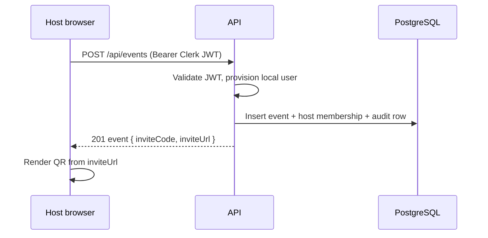
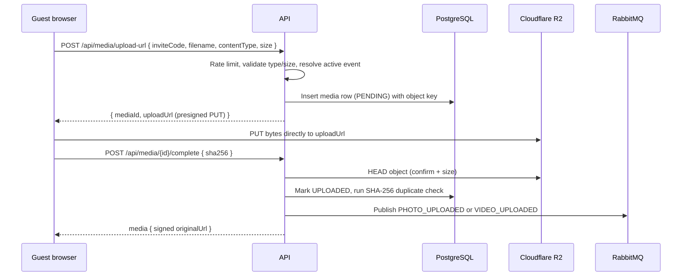
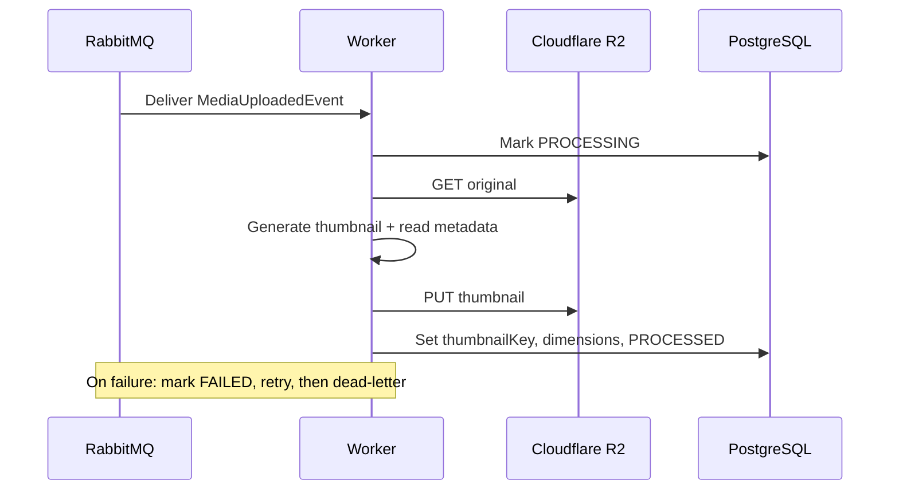

# Architecture

## Overview

EventShare is a modular monolith plus a background worker. The API service owns all
synchronous request handling and the database schema. The worker owns slow, CPU- or
IO-heavy media processing. They communicate asynchronously through RabbitMQ and share
state through PostgreSQL and Cloudflare R2 object storage.

This shape was chosen deliberately over microservices. A single team operating a single
VPS benefits from one deployable for the request path (simple transactions, no distributed
calls, easy local development) while still isolating the one genuinely different workload
(media processing) that has different scaling and failure characteristics. The module
boundaries inside the API (user, event, media, audit) are clean enough that any module
could later be extracted into its own service without a rewrite.

## Components

The API service is a Spring Boot application. Each domain lives in its own package with a
controller, service, repository, and DTOs. Cross-cutting concerns (security, error
handling, rate limiting, object keys) live under a common package. The API validates Clerk
JSON Web Tokens as an OAuth2 resource server, issues presigned R2 URLs, persists metadata,
and publishes processing events.

The worker is a separate Spring Boot application with no web-facing endpoints other than
its actuator probes. It consumes media events from RabbitMQ, downloads originals from R2,
produces thumbnails (Thumbnailator for images, ffmpeg for video poster frames), extracts
dimensions and duration, uploads the thumbnail back to R2, and updates the media row.

PostgreSQL is the system of record for all metadata. Cloudflare R2 holds all binary media.
RabbitMQ decouples upload acknowledgement from processing. nginx terminates client traffic
and routes to the frontend, the API, and Grafana. Prometheus scrapes the services and
RabbitMQ; Grafana visualizes them.

## Key data flows

### Event creation (host)

### Guest upload (direct to R2)

### Asynchronous processing (worker)

## Security model

Authentication is Clerk-centric. Clerk issues RS256 JWTs to the frontend; the API trusts
them by verifying the JWKS signature plus issuer and audience when configured. Local user
rows are provisioned just in time from the token subject.

Guest access is capability-based. Possession of an unguessable, high-entropy invite code is
the authorization to view a gallery and to request upload URLs for that event. This keeps
guest friction near zero (no signup) while bounding blast radius: codes are not enumerable,
uploads are rate limited per IP and validated for content type and size, and presigned URLs
are short lived and scoped to a single object key. Host-only actions (event management,
analytics, moderation) require a Clerk JWT and an ownership check in the service layer.

CSRF protection is not applicable to the API because it authenticates from bearer tokens,
never cookies. All mutating host endpoints require the token. See `docs/DECISIONS.md` for
the full rationale.

## Scalability

The API is stateless and can run as multiple replicas behind nginx; the only in-process
state is the rate limiter, which is explicitly documented as a single-node simplification to
swap for Redis when scaling out. The worker scales horizontally by adding consumers: RabbitMQ
distributes queue messages across them, and prefetch plus concurrency settings bound per-node
load. PostgreSQL is the primary vertical bottleneck; the gallery uses keyset pagination and a
covering index so reads stay fast as media volume grows. R2 scales independently and serves
bytes directly to clients, so neither the API nor the worker is in the media data path for
delivery.

## Failure handling

Each work queue dead-letters to a fanout exchange and a durable dead-letter queue, so a
poison message is retained for inspection rather than lost or infinitely redelivered. The
listener retries with backoff before dead-lettering. Upload completion is idempotent:
re-calling complete after success returns the current state without republishing. Audit
writes run in their own transaction so they neither roll back nor are rolled back by the
business operation they record.

## Notable tradeoffs

Polling versus WebSocket: the gallery refreshes by re-polling its first page on an interval.
This is simple, robust, and adequate for event-scale traffic. True push via WebSocket is a
planned upgrade and the cleaner long-term answer for large live events.

Client-supplied SHA-256: the browser hashes the file for instant exact-duplicate detection.
The worker can independently recompute and reconcile if stronger guarantees are required.

Exact duplicates only (v1): detection is byte-identical SHA-256. Perceptual or AI-based
near-duplicate clustering is intentionally deferred; the schema already carries the
`is_duplicate` and `duplicate_of_id` columns so it can be layered on without migration churn.
