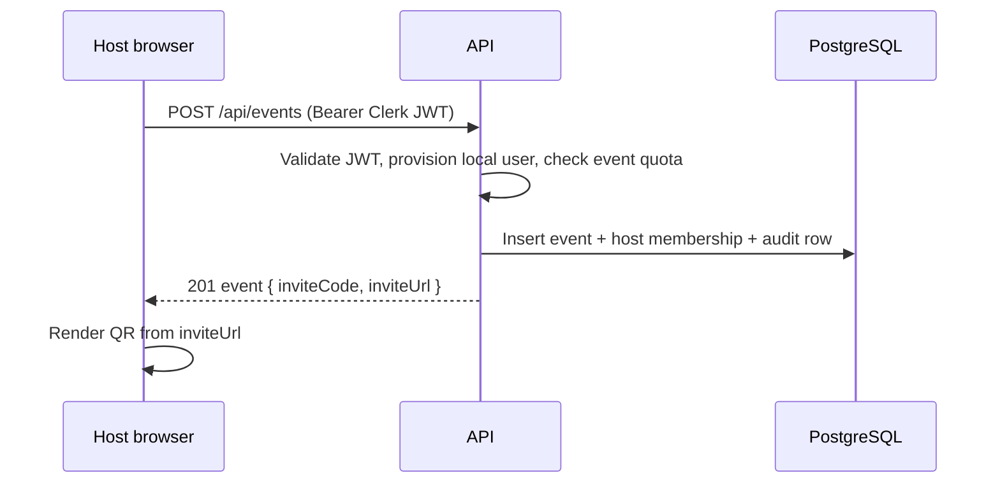
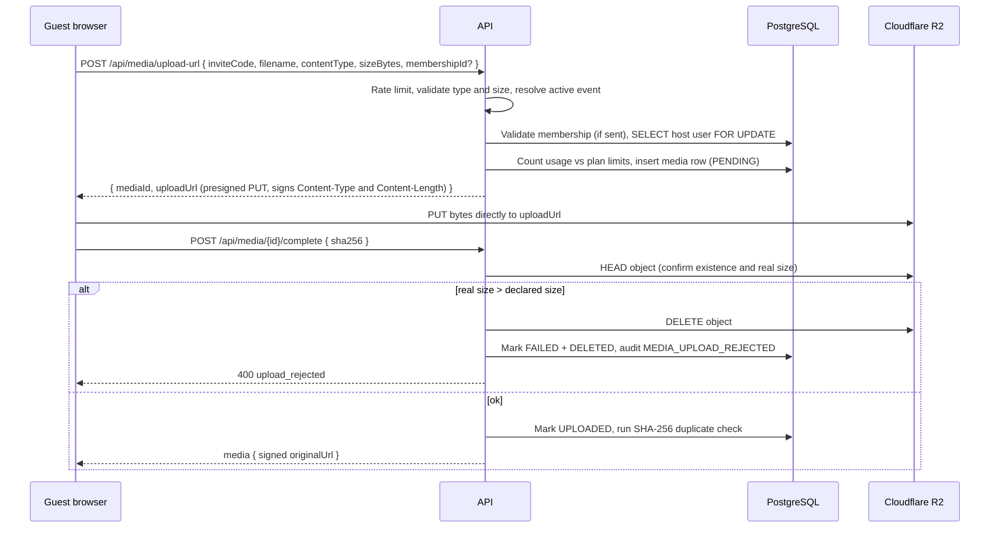
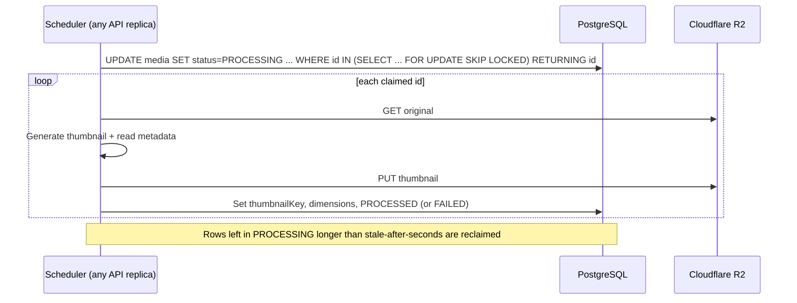

# Architecture

> Last reviewed: 2026-10-05. This document describes the code that runs today. The
> RabbitMQ and standalone worker design that earlier versions of this file described is
> kept, switched off, in `worker/` and `infra/rabbitmq/`; it is summarised at the end under
> "Deferred: broker-backed processing".

## Overview

EventShare is a modular monolith. A single Spring Boot API owns all request handling, the
database schema, and background media processing. State lives in PostgreSQL (metadata) and
Cloudflare R2 (media bytes). nginx fronts the Next.js frontend and the API.

This shape was chosen deliberately over microservices. One team operating one VPS benefits
from one deployable: simple transactions, no distributed calls, and easy local development.
The domain packages inside the API (event, media, subscription, billing, promo, whitelist,
analytics, audit, admin) have clean boundaries, so any one of them can be extracted later
without a rewrite. Media processing was originally a separate worker behind RabbitMQ; it was
folded back into the API because on a single small host the broker added operational cost
without adding capacity (see ADR-013).

## Components

API service (Spring Boot 3.5, Java 25). Each domain package has a controller, service,
repository, and DTOs. Cross-cutting concerns (security, error handling, rate limiting,
object keys, request correlation) live under `common` and `config`. The API validates Clerk
JWTs as an OAuth2 resource server, issues presigned R2 URLs, enforces plan quotas, persists
metadata, and runs the media processing scheduler.

Media processing (inside the API). `MediaProcessingScheduler` polls every few seconds and
claims work through `MediaWorkQueue`, which atomically moves rows from UPLOADED to PROCESSING
with `FOR UPDATE SKIP LOCKED`. `MediaProcessingService` downloads the original from R2,
generates a thumbnail (Thumbnailator for images, ffmpeg for video poster frames), extracts
dimensions and duration, uploads the thumbnail, and marks the row PROCESSED or FAILED. The
`media.status` column is the work queue.

Frontend (Next.js 15 App Router). Host dashboard, event management, guest gallery at
`/e/[code]`, pricing, and the admin panel. Guests upload straight to R2.

Mobile (Expo). A separate React Native client for the guest flow and basic host tools.

PostgreSQL 16 is the system of record. Cloudflare R2 holds all binary media. Prometheus
and Grafana are optional (Compose `monitoring` profile).

## Key data flows

### Event creation (host)

```mermaid
sequenceDiagram
  participant H as Host browser
  participant API as API
  participant DB as PostgreSQL
  H->>API: POST /api/events (Bearer Clerk JWT)
  API->>API: Validate JWT, provision local user, check event quota
  API->>DB: Insert event + host membership + audit row
  API-->>H: 201 event { inviteCode, inviteUrl }
  H->>H: Render QR from inviteUrl
```

### Guest upload (direct to R2)

```mermaid
sequenceDiagram
  participant G as Guest browser
  participant API as API
  participant DB as PostgreSQL
  participant R2 as Cloudflare R2
  G->>API: POST /api/media/upload-url { inviteCode, filename, contentType, sizeBytes, membershipId? }
  API->>API: Rate limit, validate type and size, resolve active event
  API->>DB: Validate membership (if sent), SELECT host user FOR UPDATE
  API->>DB: Count usage vs plan limits, insert media row (PENDING)
  API-->>G: { mediaId, uploadUrl (presigned PUT, signs Content-Type and Content-Length) }
  G->>R2: PUT bytes directly to uploadUrl
  G->>API: POST /api/media/{id}/complete { sha256 }
  API->>R2: HEAD object (confirm existence and real size)
  alt real size > declared size
    API->>R2: DELETE object
    API->>DB: Mark FAILED + DELETED, audit MEDIA_UPLOAD_REJECTED
    API-->>G: 400 upload_rejected
  else ok
    API->>DB: Mark UPLOADED, run SHA-256 duplicate check
    API-->>G: media { signed originalUrl }
  end
```

### Media processing (in-process scheduler)

```mermaid
sequenceDiagram
  participant S as Scheduler (any API replica)
  participant DB as PostgreSQL
  participant R2 as Cloudflare R2
  S->>DB: UPDATE media SET status=PROCESSING ... WHERE id IN (SELECT ... FOR UPDATE SKIP LOCKED) RETURNING id
  loop each claimed id
    S->>R2: GET original
    S->>S: Generate thumbnail + read metadata
    S->>R2: PUT thumbnail
    S->>DB: Set thumbnailKey, dimensions, PROCESSED (or FAILED)
  end
  Note over S,DB: Rows left in PROCESSING longer than stale-after-seconds are reclaimed
```

## Security model

Authentication is Clerk-centric. Clerk issues RS256 JWTs to the frontend; the API verifies
the JWKS signature plus issuer and audience when configured. Local user rows are provisioned
just in time from the token subject. Admin rights come from the persisted user role.

Guest access is capability-based. Possession of an unguessable invite code authorises viewing
a gallery and requesting upload URLs for that event. Joining an event creates a guest
membership whose id is returned only to that guest; it acts as the guest's private
credential:

- Self-delete of media requires the uploader's membership id and an ACTIVE membership. A
  matching display name is not accepted, because names are public in the gallery.
- If an upload request carries a membership id, it must be an ACTIVE membership of that
  event, and the stored uploader name is taken from the membership, not the request.
- The gallery accepts an optional `X-Membership-Id` header and returns `ownedByRequester`
  per item. The membership id itself is never returned in public responses.

Uploads are bounded at three layers: the API validates declared type and size against the
event and plan; the presigned PUT signs Content-Type and Content-Length so R2 rejects a
different body; and completion compares R2's real object size with the declared size.
Presigned URLs are short lived and scoped to one object key.

Host-only actions (event management, analytics, moderation) require a Clerk JWT and an
ownership check in the service layer. CSRF protection is not applicable because the API
authenticates with bearer tokens, never cookies.

## Concurrency and quotas

Plan limits (photos and videos per event, storage per host) are checked inside the same
transaction that inserts the PENDING media row, after locking the host's `users` row with
`SELECT ... FOR UPDATE`. Concurrent upload requests for any of one host's events therefore
run the "count, compare, insert" sequence one at a time, and a request that arrives second
sees the first one's row. PENDING rows count toward quota, so a reservation holds its slot.
Rejected uploads are marked DELETED and stop counting. Abandoned PENDING reservations also
keep counting until cleaned up; see "Known gaps".

## Scalability

The API is stateless apart from two items:

- The rate limiter is in-process (fixed window per key). With N replicas the effective limit
  becomes N times the configured value. Swap the backing store for Redis or Bucket4j with a
  shared store before running more than one replica on a public endpoint (ADR-015).
- The processing scheduler is replica-safe: `FOR UPDATE SKIP LOCKED` gives each replica a
  disjoint batch. `stale-after-seconds` must be longer than the slowest processing run.

PostgreSQL is the primary vertical bottleneck. The gallery uses keyset pagination and the
`ix_media_gallery` index so reads stay fast as media grows. R2 serves bytes directly to
clients, so the API is not in the media delivery path.

## Failure handling

Upload completion is idempotent: re-calling complete after success returns the current
state. A processing failure marks the row FAILED and is counted in
`eventshare.media.processing.failed`. A crash mid-processing leaves the row in PROCESSING;
it is reclaimed once it is older than the staleness cutoff. Audit writes run in their own
transaction so they neither roll back nor are rolled back by the operation they record.

## Notable tradeoffs

Polling versus WebSocket: the gallery re-polls its first page every 15 seconds. Simple and
adequate at event scale; WebSocket push is the long-term answer for large live events.

Client-supplied SHA-256: the browser hashes the file for instant exact-duplicate detection.
A malicious client can lie about the hash, which only affects the duplicate flag, never
authorisation. The processor could recompute it if stronger guarantees are needed.

Exact duplicates only: detection is byte-identical SHA-256. Near-duplicate clustering is
deferred; `is_duplicate` and `duplicate_of_id` already exist in the schema.

## Known gaps

- Abandoned PENDING reservations (URL issued, never completed) are not swept, so they keep
  counting toward quota. A scheduled cleanup of PENDING rows older than the upload URL TTL
  (plus a margin) should delete the row and any partial object.
- Rate limiting is per instance (see Scalability).
- Uploads made without a membership cannot be self-deleted; only the host can remove them.

## Deferred: broker-backed processing

`worker/` contains a standalone Spring Boot consumer and `infra/rabbitmq/` its broker
configuration. In that design the API published `PHOTO_UPLOADED` / `VIDEO_UPLOADED` events to
a topic exchange, the worker consumed them, and failures dead-lettered to a durable DLQ. It
is retained for when processing needs its own scaling and failure domain (for example GPU
work for near-duplicate detection). Re-enabling it means publishing from `completeUpload`
again and disabling `eventshare.processing.enabled` in the API.
