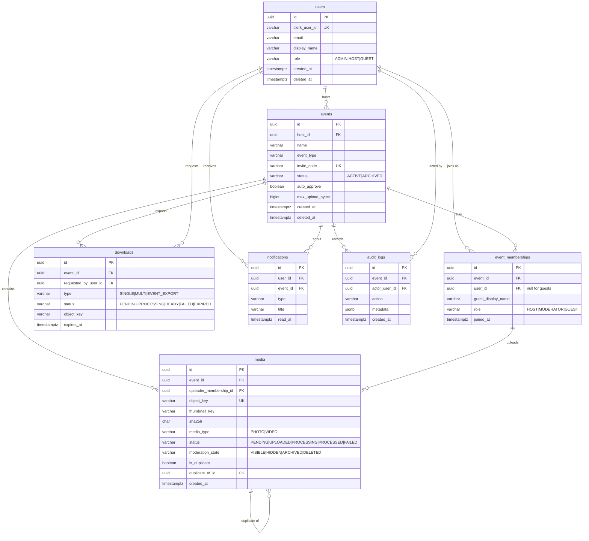

# Database ERD

PostgreSQL 16. The full schema is defined in
`backend/src/main/resources/db/migration/V1__init.sql` and applied by Flyway at API startup.
All tables use UUID primary keys, timestamptz auditing columns, and (except audit_logs) a
soft-delete marker.

## Table reference

users holds authenticated principals (hosts and admins), keyed by the Clerk subject in
`clerk_user_id`. Anonymous guests do not require a row here.

events is the shared media room. `invite_code` is unique and high-entropy and is the guest
capability. `auto_approve` decides whether guest uploads are immediately VISIBLE or held
HIDDEN for host review. `max_upload_bytes` optionally overrides the global per-file limit.

event_memberships links a participant to an event. A set `user_id` means an authenticated
participant; a null `user_id` with a `guest_display_name` means an anonymous guest. A partial
unique index enforces one membership per authenticated user per event while allowing many
guests.

media is metadata for one uploaded photo or video; bytes live in R2. `status` tracks the
processing lifecycle and `moderation_state` tracks host-controlled visibility; these are
deliberately independent. `object_key` is unique. Exact duplicate detection sets
`is_duplicate` and `duplicate_of_id`. The covering index `(event_id, moderation_state,
created_at desc)` backs the keyset gallery query.

downloads models asynchronous export jobs (single file, multiple files, or a full-event ZIP).
The worker will populate `object_key` with the generated ZIP and set `status` to READY.

notifications are host-facing in-app messages, for example when an export is ready.

audit_logs is append-only (no update or soft-delete columns). It records
security- and moderation-relevant actions with a JSONB metadata payload and the actor.

## Conventions

Enumerations are stored as VARCHAR with CHECK constraints rather than native enum types, so
new values can be added in a migration without an ALTER TYPE. `updated_at` is maintained by a
trigger (`set_updated_at`) so it stays correct even for writes that do not go through JPA.
Soft delete uses `deleted_at IS NULL` to mean a live row; queries that must exclude deleted
rows filter on it explicitly.

## V2 additions

New tables introduced in V2 (migrations V4 to V9):

plans is the seeded plan catalogue (code primary key) with per-event and per-account limits and
feature flags. subscriptions holds one active row per user (unique partial index on user_id),
linked to a plan and optionally a Stripe subscription, with a source of STRIPE, PROMO, WHITELIST,
or ADMIN. promo_codes and promo_code_usage track promotional codes and per-user redemption (unique
on promo_code_id plus user_id). whitelisted_users grants unlimited access by email. event_analytics
is a per-event rollup, event_visits records distinct visitors (unique on event_id plus visitor_key)
for unique-visitor and active-guest counts, and storage_usage is per-account storage accounting.

Changed tables: users gained disabled, stripe_customer_id, and last_seen_at; events gained
cover_media_id, expires_at, uploader_visibility, and the show_* visibility flags; event_memberships
gained status (ACTIVE/LEFT/REMOVED) and last_activity_at.
