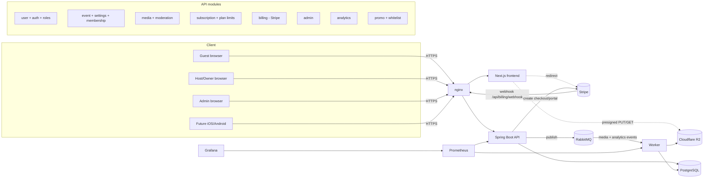
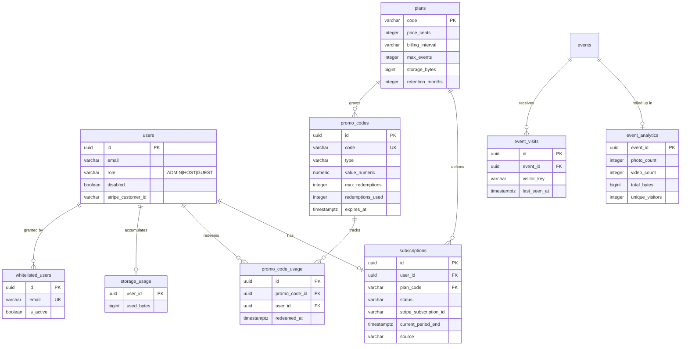

# EventShare V2 Design Proposal

Status: awaiting approval. No application code or migrations are written until this is signed off.

This document delivers the five requested artifacts: (1) updated architecture, (2) updated
database schema, (3) updated API contracts, (4) dashboard wireframes, and (5) an implementation
plan. It builds on the existing modular-monolith-plus-worker architecture and keeps the data
model mobile-ready so the future iOS and Android apps reuse the same API.

## 0. Locked decisions and reconciliations

Three decisions were confirmed before drafting:

1. Payments: full Stripe checkout now (hosted checkout, webhooks, billing portal).
2. Plan scope: per-user subscription. One active subscription per account governs all of that
   user's events.
3. Admin role: a database role flag (users.role = ADMIN), with the first admin
   (admin@example.com) granted at provisioning time.

Reconciliations and assumptions worth your eye before approval:

- Pricing model. The spec quotes prices "per event" ($19/$49/$99), but you chose a per-user
  subscription. This proposal therefore treats the four tiers as recurring per-account plans:
  Basic and Wedding Pro are monthly/annual subscriptions, Lifetime is a one-time purchase that
  never expires. The numeric limits (guests, photos, videos, storage) are applied per event,
  while "max events" and total account storage are applied per account. If you actually want
  one-time per-event purchases, that is a different Stripe model (checkout per event, no
  recurring subscription); say so and I will swap section 3.7 and the subscriptions schema.
- Persistent membership requires an account. "My Events" can only persist for a signed-in user.
  Anonymous quick-join (name only) stays for zero-friction uploading, but such guests do not get
  a "My Events" entry. When a signed-in user joins, we create a durable membership tied to their
  account. This is the single biggest behavioral change in V2.
- Admin bootstrap with JIT users. Because users are provisioned just-in-time from Clerk, we
  cannot seed a user row by email in a migration (the row does not exist until first login).
  Mechanism: an ADMIN_EMAILS environment value (seeded with your email); at provisioning the
  service sets role = ADMIN when the verified email matches. This is the "seeded DB flag"
  realized for a JIT model.
- Retention/expiration. Event expiration is derived from the owner's plan at creation
  (Basic 12 months, Wedding Pro 24 months, Lifetime none, Free a configurable window).

## 1. Updated architecture

New backend modules (still inside the single API deployable): subscription, billing (Stripe),
admin, analytics, plus an expanded event/media surface for settings and moderation. One new
external dependency: Stripe. The worker gains an analytics-rollup consumer. Nothing about the
single-VPS Docker Compose topology changes except two added secrets (Stripe keys) and one added
inbound route (the Stripe webhook).



Cross-cutting additions: a PlanLimitService consulted before event creation and before each
upload (enforces quotas), a StorageAccountingService updated when media is finalized or deleted,
and an AdminGuard (method security on ROLE_ADMIN). The Stripe webhook is the only new unauthenticated
inbound endpoint and is verified by Stripe signature, not by Clerk.

## 2. Updated database schema

Existing tables (users, events, event_memberships, media, downloads, notifications, audit_logs)
are extended; six new areas are added. All new tables keep the UUID + timestamps + soft-delete
conventions. Migrations are forward-only (V3 onward; V1 and V2 already shipped).

### 2.1 Changes to existing tables

users: add role usage (ADMIN already allowed), disabled BOOLEAN default false,
stripe_customer_id VARCHAR null, last_seen_at TIMESTAMPTZ null.

events: add cover_media_id UUID null (FK media), expires_at TIMESTAMPTZ null,
uploader_visibility VARCHAR ('ANONYMOUS'|'NAMED') default 'NAMED',
show_upload_timestamps BOOLEAN default true, show_uploader_names BOOLEAN default true,
show_upload_stats BOOLEAN default true.

event_memberships: add status VARCHAR ('ACTIVE'|'LEFT'|'REMOVED') default 'ACTIVE',
last_activity_at TIMESTAMPTZ null. The existing partial unique index already enforces one
membership per (event, user). Signed-in joins now always set user_id.

media: no structural change (status + moderation_state + soft delete already exist). Moderation
endpoints simply drive moderation_state transitions and write audit rows.

### 2.2 New tables

plans (data-driven tier limits, seeded; adminable):
  code PK ('FREE'|'BASIC'|'WEDDING_PRO'|'LIFETIME'), name, price_cents, billing_interval
  ('NONE'|'MONTH'|'YEAR'|'ONE_TIME'), stripe_price_id, max_events, max_guests_per_event,
  max_photos_per_event, max_videos_per_event, storage_bytes (account cap), zip_export BOOLEAN,
  advanced_analytics BOOLEAN, priority_processing BOOLEAN, retention_months INTEGER null,
  is_active BOOLEAN.

subscriptions (one active per user):
  id PK, user_id FK unique-active, plan_code FK plans, status
  ('ACTIVE'|'TRIALING'|'PAST_DUE'|'CANCELED'|'EXPIRED'), stripe_subscription_id,
  current_period_end TIMESTAMPTZ, cancel_at_period_end BOOLEAN, source
  ('STRIPE'|'PROMO'|'WHITELIST'|'ADMIN'), timestamps, soft delete.

promo_codes:
  id PK, code UNIQUE, type ('PERCENT'|'FIXED'|'FREE_EVENT'|'TEMP_PREMIUM'|'LIFETIME_PREMIUM'),
  value_numeric (percent or cents), grants_plan_code FK plans null, duration_days INTEGER null,
  max_redemptions INTEGER null, redemptions_used INTEGER default 0, stripe_coupon_id null,
  expires_at TIMESTAMPTZ null, is_active BOOLEAN, created_by FK users, timestamps.

promo_code_usage:
  id PK, promo_code_id FK, user_id FK, redeemed_at, resulting_subscription_id FK null,
  UNIQUE(promo_code_id, user_id) to prevent double-redeem.

whitelisted_users:
  id PK, email UNIQUE, grants ('UNLIMITED' default), note, granted_by FK users,
  is_active BOOLEAN, timestamps. On provisioning/login, a matching email yields an effective
  unlimited plan (source = WHITELIST).

event_analytics (one row per event, incrementally maintained):
  event_id PK/FK, photo_count, video_count, total_bytes, unique_visitors, active_guests_7d,
  uploads_today, uploads_today_date DATE, last_activity_at, updated_at.

event_visits (supports unique visitors / active guests):
  id PK, event_id FK, visitor_key (membership id for signed-in, hashed ip+ua for anonymous),
  first_seen_at, last_seen_at, UNIQUE(event_id, visitor_key).

storage_usage (per-account accounting; fast quota checks):
  user_id PK/FK, used_bytes BIGINT default 0, updated_at. Updated transactionally on media
  finalize (+bytes) and hard-delete (-bytes).

### 2.3 ERD (new and changed entities)



### 2.4 Migration sequence

V3 alter users/events/event_memberships; V4 plans (+ seed four tiers); V5 subscriptions;
V6 promo_codes + promo_code_usage; V7 whitelisted_users; V8 event_analytics + event_visits +
storage_usage. Each is small and independently reversible-by-design (forward-only with
expand/contract where a column is added before code reads it).

## 3. Updated API contracts

Auth legend: [Auth] valid Clerk JWT; [Owner] authenticated and owns the event; [Admin]
ROLE_ADMIN; [Capability] public, authorized by invite code; [Stripe] verified by Stripe
signature. All responses are JSON; errors stay RFC 7807 with a stable code. New endpoints are
additive; existing V1 endpoints are unchanged unless noted.

### 3.1 My Events and persistent membership

- POST /api/events/code/{code}/join  [Auth or Capability]. If the caller is signed in, create or
  reactivate a persistent membership (status ACTIVE, user_id set) and return it; anonymous callers
  behave as today. Idempotent per (event, user).
- GET /api/me/events  [Auth]. Returns the caller's events grouped as owned / joined, each card with:
  name, coverImageUrl, eventDate, role (OWNER|GUEST), photoCount, videoCount, lastActivityAt,
  membershipStatus. Drives the "My Events" screen. Excludes archived unless ?include=archived.
- DELETE /api/me/events/{eventId}/membership  [Auth]. Voluntarily leave an event (status LEFT).
- DELETE /api/events/{eventId}/members/{membershipId}  [Owner]. Owner removes a guest
  (status REMOVED); writes an audit row.

### 3.2 Dashboards

- GET /api/me/dashboard  [Auth]. Logged-in user summary: eventsOwned, eventsJoined, totalPhotos,
  totalVideos, recentActivity[], recentEvents[].
- GET /api/events/{eventId}/dashboard  [Owner]. Owner analytics: totalPhotos, totalVideos,
  uploadsToday, storageUsedBytes, totalGuests, uniqueVisitors, activeGuests, createdAt, expiresAt,
  uploadActivitySeries[] (per-day counts for a graph).
- GET /api/me/guest-summary  [Auth]. Guest view: eventsJoined, personalUploadCount,
  quotaUsage{usedBytes, limitBytes, photosUsed, photosLimit}, recentlyViewed[].

### 3.3 Event settings

- GET /api/events/{eventId}/settings  [Owner]. Returns identity + metadata visibility settings.
- PATCH /api/events/{eventId}/settings  [Owner]. Update uploaderVisibility (ANONYMOUS|NAMED),
  showUploadTimestamps, showUploaderNames, showUploadStats, name, eventDate, coverMediaId.
- The public gallery and media responses honor these: when ANONYMOUS or showUploaderNames=false,
  uploader fields are stripped for non-owners; the owner always sees full metadata.

### 3.4 Media moderation

- PATCH /api/events/{eventId}/media/{mediaId}/moderation  [Owner]. Body { action } where action in
  HIDE | UNHIDE | ARCHIVE | RESTORE | DELETE. Drives moderation_state transitions
  (VISIBLE/HIDDEN/ARCHIVED/DELETED); DELETE is soft and recoverable via RESTORE. Each writes audit.
- DELETE /api/events/{eventId}/media/{mediaId}/permanent  [Owner]. Hard delete: removes the R2
  objects and the row, decrements storage_usage. Irreversible.
- GET /api/events/{eventId}/media  [Owner]. Owner gallery including non-visible states with a
  ?state= filter; the existing public gallery stays VISIBLE-only.
- GET /api/events/{eventId}/media/{mediaId}/download  [Owner or Capability if allowed]. Returns a
  short-lived signed download URL for the original.

### 3.5 Media details and metadata

- GET /api/events/code/{code}/media/{mediaId}  [Capability]. Detail view: uploadTimestamp, uploadDate,
  uploader (subject to settings), fileSizeBytes, mediaType, width/height/duration, originalUrl,
  thumbnailUrl. Owner-scoped variant returns full metadata regardless of settings.

### 3.6 Admin panel  [Admin] on all

- GET /api/admin/users?query=&page=  Search/list users.
- GET /api/admin/users/{id}  User detail incl. subscription and storage.
- POST /api/admin/users/{id}/disable  and  /enable.
- DELETE /api/admin/users/{id}  Soft-delete a user.
- POST /api/admin/users/{id}/subscription  Set plan (source ADMIN), no charge.
- GET /api/admin/events?query=&page=  List all events.
- POST /api/admin/events/{id}/archive  and  DELETE /api/admin/events/{id}.
- POST /api/admin/events/{id}/transfer  Body { newOwnerUserId }.
- GET /api/admin/analytics  totals: users, events, uploads, storageBytes, monthlyGrowth[].

### 3.7 Subscriptions and Stripe billing

- GET /api/plans  [Public]. Lists active plans (for the pricing page) from the plans table.
- GET /api/me/subscription  [Auth]. Current plan, status, periodEnd, effectiveLimits (after
  promo/whitelist overrides).
- POST /api/billing/checkout-session  [Auth]. Body { planCode }. Creates a Stripe Checkout
  session (subscription mode for Basic/Wedding Pro, payment mode for Lifetime) and returns the
  redirect URL. Free needs no checkout.
- POST /api/billing/portal-session  [Auth]. Returns a Stripe billing-portal URL for the customer.
- POST /api/billing/webhook  [Stripe]. Verified by signature. Handles
  checkout.session.completed, customer.subscription.updated/deleted, invoice.payment_failed;
  updates subscriptions.status and plan. This is the source of truth for activation, never the
  client redirect.

### 3.8 Promo codes

- POST /api/me/promo/redeem  [Auth]. Body { code }. Validates active + not expired + redemptions
  remaining + not already used by this user; applies the benefit (discount via Stripe coupon at
  checkout, or grants a plan/temp-premium directly); records promo_code_usage.
- Admin CRUD: POST/PATCH /api/admin/promo-codes, POST /api/admin/promo-codes/{id}/disable,
  GET /api/admin/promo-codes (with usageCount, remaining, expiresAt).

### 3.9 Whitelist

- Admin: GET /api/admin/whitelist, POST /api/admin/whitelist { email }, DELETE
  /api/admin/whitelist/{id}. A whitelisted email resolves to an effective unlimited plan at
  request time (checked in PlanLimitService), with no billing.

### 3.10 Limit enforcement (cross-cutting)

The existing POST /api/media/upload-url gains pre-checks via PlanLimitService: per-guest upload
count, per-event photo/video counts, and account storage cap. On breach it returns 403 with code
quota_exceeded and a machine-readable detail ({ limit, used, scope }) so the UI can show
"You have reached your upload limit" / "This event has reached its storage limit" and an Upgrade
call to action. Event creation (POST /api/events) checks max_events for the account's plan.

## 4. UI wireframes (mobile-first)

Drawn at phone width. Desktop expands cards into multi-column grids. A persistent bottom nav
(Home, My Events, Create, Account) appears for signed-in users; a top breadcrumb plus back arrow
appears on every nested screen. All lists have loading skeletons, empty states, and error states.

### 4.1 Marketing homepage (logged out)

```
+--------------------------------------+
| EventShare            [Sign In]      |
+--------------------------------------+
|  Every photo from your event,        |
|  in one shared gallery.              |
|                                      |
|  [ Create Event ]  [ Join Event ]    |
+--------------------------------------+
|  How it works  (3 steps, icons)      |
+--------------------------------------+
|  Features  (grid of 4)               |
+--------------------------------------+
|  Pricing  Free / Basic / Pro / Life  |
|  [See plans ->]                      |
+--------------------------------------+
|  Testimonials (placeholder cards)    |
+--------------------------------------+
|  FAQ (accordion)                     |
+--------------------------------------+
|  Footer                              |
+--------------------------------------+
```

### 4.2 My Events / user dashboard (signed in)

```
+--------------------------------------+
| < Home        Dashboard       (you)  |
+--------------------------------------+
| Owned 2 | Joined 5 | Photos 311 | Vid 12
+--------------------------------------+
| Recent activity                      |
|  - Alice uploaded 3 photos  2m       |
|  - You created "Reunion"   1h        |
+--------------------------------------+
| My Events                  [+ New]   |
| +----------------------------------+ |
| | [cover] Sam & Tari Wedding  OWNER| |
| | Aug 15 - 210 photos - 12 videos  | |
| | last activity 2m ago             | |
| +----------------------------------+ |
| | [cover] Church Picnic       GUEST| |
| | Jun 02 - 80 photos - 3 videos    | |
| +----------------------------------+ |
+--------------------------------------+
| [Home] [My Events] [+ Create] [Acct] |
+--------------------------------------+
```

### 4.3 Owner event dashboard

```
+--------------------------------------+
| < My Events   Sam & Tari      OWNER  |
+--------------------------------------+
| [Gallery] [Guests] [Settings] [Stats]|
+--------------------------------------+
| Photos 210 | Videos 12 | Today 18    |
| Storage 4.2/50 GB | Guests 42        |
| Unique visitors 60 | Active 9        |
+--------------------------------------+
| Upload activity (bar graph, 14 days) |
|  ____                                |
| |   |    ___      ___               |
| |   |__ |   |__  |   |__            |
+--------------------------------------+
| Created Jun 20 - Expires Jun 2027    |
+--------------------------------------+
```

### 4.4 Guest dashboard / event view

```
+--------------------------------------+
| < My Events   Church Picnic   GUEST  |
+--------------------------------------+
| Your uploads 7 | Quota 120MB/5GB     |
+--------------------------------------+
| [ + Add photos & videos ]  [Camera]  |
+--------------------------------------+
| Gallery (2-col, lazy, infinite)      |
| [img][img]                           |
| [img][img]   names hidden if owner   |
|              set Anonymous mode       |
+--------------------------------------+
```

### 4.5 Event settings (owner)

```
+--------------------------------------+
| < Event       Settings               |
+--------------------------------------+
| Uploader visibility                  |
|  (o) Named uploads  ( ) Anonymous    |
| Show upload timestamps      [x]      |
| Show uploader names         [x]      |
| Show upload statistics      [ ]      |
+--------------------------------------+
| Cover image  [choose from gallery]   |
| Event date   [ 2026-08-15 ]          |
+--------------------------------------+
| Danger: Archive event / Delete event |
+--------------------------------------+
```

### 4.6 Pricing page

```
+--------------------------------------+
| Plans                                |
| +------------+ +------------+        |
| | FREE  $0   | | BASIC $19  |        |
| | 1 event    | | 100 guests |        |
| | 500 photos | | 5k photos  |        |
| | [Current]  | | [Choose]   |        |
| +------------+ +------------+        |
| +------------+ +------------+        |
| | PRO  $49   | | LIFE  $99  |        |
| | unlimited  | | unlimited  |        |
| | [Choose]   | | [Choose]   |        |
| +------------+ +------------+        |
| Promo code [__________] [Apply]      |
+--------------------------------------+
```

### 4.7 Admin panel

```
+--------------------------------------+
| Admin            ADMIN               |
+--------------------------------------+
| [Users] [Events] [Promo] [Whitelist] |
|                       [Analytics]    |
+--------------------------------------+
| Users  search [__________]           |
| name        plan    status  actions  |
| Munashe     PRO     active  [..]     |
| Alice       FREE    active  [disable]|
+--------------------------------------+
| Totals: 1.2k users - 340 events      |
|         88k uploads - 1.1 TB         |
+--------------------------------------+
```

## 5. Implementation plan

Sequenced so each phase is independently testable and the data layer lands before the features
that depend on it. Backend and the matching frontend ship together per phase; a final polish pass
covers the global UX requirements. Relative size in parentheses (S/M/L).

Phase 0. Prerequisites (S). Resolve the Java version (set both poms to 21, or align the Docker
base images to 25) so the api/worker can be rebuilt; deploy the AuditService fix already in source;
restore the audit FK that was dropped for dev (the fix makes it safe again); create a Stripe
account and capture test keys; add Stripe CLI for local webhook forwarding.

Phase 1. Data foundation (M). Migrations V3-V8, seed the four plans, add the ADMIN_EMAILS
provisioning rule, storage_usage + event_analytics scaffolding. Entities and repositories only.

Phase 2. Persistent membership and My Events (M). Signed-in join creates durable memberships;
GET /api/me/events; leave/remove endpoints; frontend My Events screen and bottom nav.

Phase 3. Dashboards and analytics (L). event_visits capture, storage accounting on finalize/delete,
a worker analytics-rollup consumer, the three dashboard endpoints, and their screens with graphs.

Phase 4. Moderation, settings, metadata visibility (M). Moderation transitions + permanent delete,
event settings panel, owner gallery with state filter, metadata-visibility enforcement in responses.

Phase 5. Subscriptions and Stripe (L). plans/pricing endpoints, checkout + portal sessions,
signature-verified webhook, PlanLimitService enforcement on create/upload, pricing page and
upgrade flows, quota messaging.

Phase 6. Promo codes and whitelist (M). Redemption + admin CRUD, whitelist resolution in
PlanLimitService.

Phase 7. Admin panel (M). Admin endpoints + ROLE_ADMIN guard + admin UI (users, events, promo,
whitelist, analytics).

Phase 8. Global UX polish and PWA (M). Breadcrumbs, back nav, skeletons, empty/success/error
states, bottom nav everywhere, mobile spacing audit, installable PWA service worker.

Phase 9. Docs and tests (S/M). Update ERD.md, API.md, add ADRs (per-user subscription, Stripe
webhook as source of truth, admin bootstrap), unit + integration tests for limits/promo/webhook,
extend CI.

## 6. Risks and open questions

- Pricing reconciliation. Per-user subscription vs the spec's per-event prices: confirm the
  mapping in section 0 is what you want before Phase 5.
- Stripe webhooks need a public URL. Fine in production behind nginx; locally use the Stripe CLI
  to forward to /api/billing/webhook. Activation is driven by webhooks, not the browser redirect.
- Anonymous vs account. My Events requires sign-in; confirm anonymous quick-join should remain for
  uploads (recommended) or be removed entirely.
- Unique-visitor privacy. Anonymous visitors are keyed by a salted hash of ip+user-agent, not raw
  IP, to avoid storing PII.
- Java version is a hard prerequisite for any rebuild (Phase 0).
- Scope. This is a large build; I recommend approving phases incrementally rather than all at once,
  so you can test each before the next begins.
